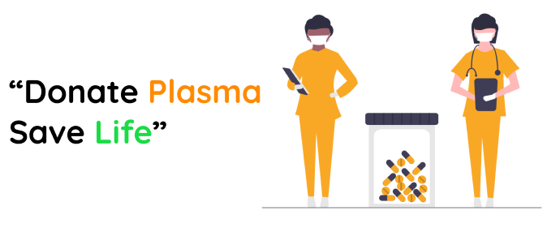
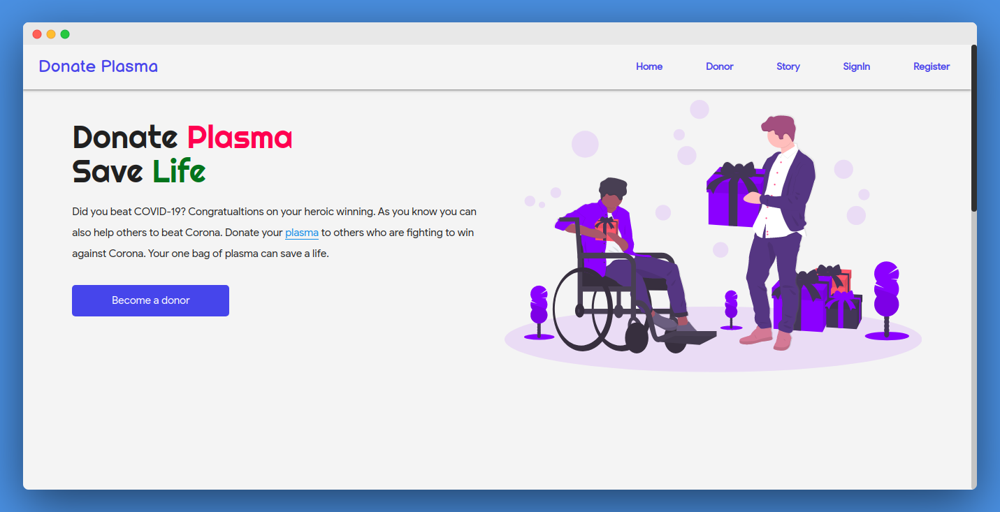
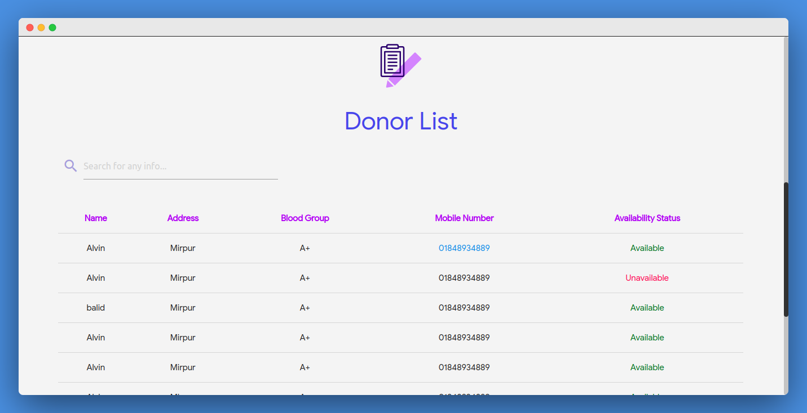
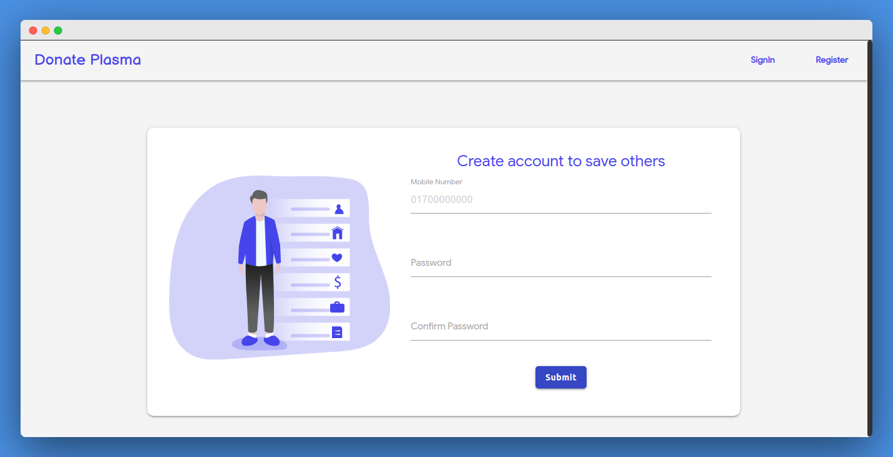
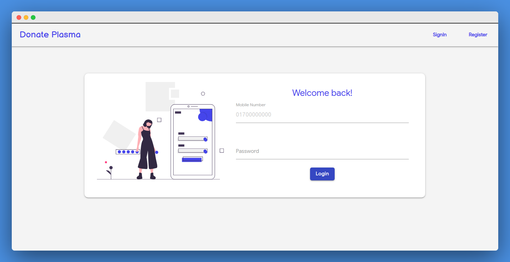
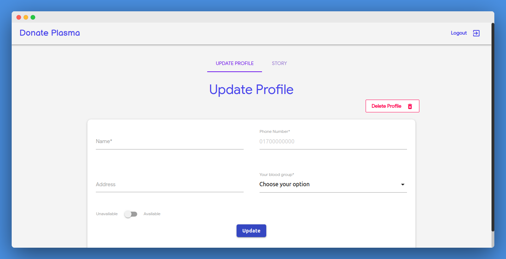
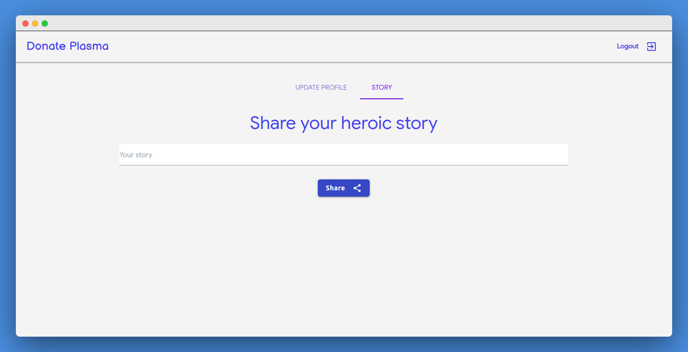
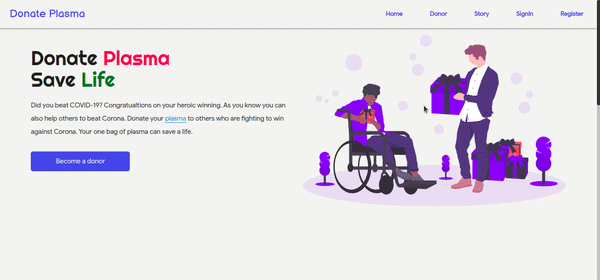

# Hello :wave:

Welcome to Donate Plasma project. As we all know, we are facing a global pandemic named as COVID-19. Scientists are trying to discover vaccines to cure people affected with corona virus. In this critical situation different types of treatments are given by different doctors. Some doctors recommended plasma therapy for the patient who is in the critical situation. In this situation it is difficult for a patient to find a donor as everybody can’t donate plasma.

## What is plasma? Why plasma is needed to cure corona virus patients?

Plasma is the clear, straw-colored liquid portion of blood that remains after red blood cells, white blood cells, platelets and other cellular components are removed. In Convalescent Plasma Therapy (CPT), plasma collected from recovered patients is infused into patients who currently have the disease.

CPT is, by far, the oldest treatment being tested to battle COVID-19, being successful in cases during the previous corona virus outbreaks such as the Sars epidemic in 2003 and the Ebola virus outbreak in 2013. Physicians used CPT effectively before the specific treatment was developed for H1N1 influenza (Spanish virus), SARS-1 and MERS virus.

## Goal of the project

As plasma donor is not available as blood donor, so it is difficult for the patients who are in need of plasma. In most of the cases, it has seen that patients or relative of the patient post in facebook or ask for plasma randomly. Some of them may find a donor but most of the time they can't manage a donor despite having someone to eager to donate plasma. But lack of connection its is not possible to get a donor. Here is where our application may come in handy. Our main aim to connect donor with the patients who need plasma in easiest way possible and as soon as possible.

## Work flow

The person who want to donate plasma would have to register first and create his account. He can also share his heroic story of defeating COVID-19. It'll motivate others who are fighting against COVID-19.

The patients who need a donor just come to our site and look for a donor randomly or by searching blood group, location information. Patient can call the donor directly from the providing number.

## Technology

- Web framework: Python django (on going)
- Web UI (CSS framework): Materializecss, Sass

## Screenshots & gif

|            Home Page            |            Donor             |
| :-----------------------------: | :--------------------------: |
|  |  |

|            Register             |            Login             |
| :-----------------------------: | :--------------------------: |
|  |  |

|           Profile            |           Share Story           |
| :--------------------------: | :-----------------------------: |
|  |  |

|                 Gif                 |
| :---------------------------------: |
|  |

## Contributors

<table>
  <tr>
   <td align="center"><a href="http://facebook.com/shunjid"> <b>Shunjid Rahman Showrov</b></a> <a href="#" title="Ideas">🤩</a><a href="#" title="Code">💻</a></td>
    <td align="center"><a href="http://facebook.com/zubayerhimel"> <b>Zubayer Himel</b></a> <a href="#" title="Planning & Feedback">🤔</a><a href="#" title="Wireframing">🦴</a><a href="#" title="Documentation">📖</a></td>
    <td align="center"><a href="https://www.facebook.com/hm.sheble"> <b>Abu-Sufian Shibli</b></a> <a href="#" title="Code">💻</a></td>
    <td align="center"><a href="https://www.facebook.com/shahfahad.hossain"> <b>Shah Fahad Hossain</b></a> <a href="#" title="Script writer for video">📝</a></td>
    <td align="center"><a href="https://www.facebook.com/nadianasrin80"> <b>Nadia Nasrin</b></a> <a href="#" title="Voice for video">🎙️</a></td>

  </tr>
  </table>

## If you like our work please show your support by giving a :star: in our repository. It helps to motivate ourselves and do awesome work.
